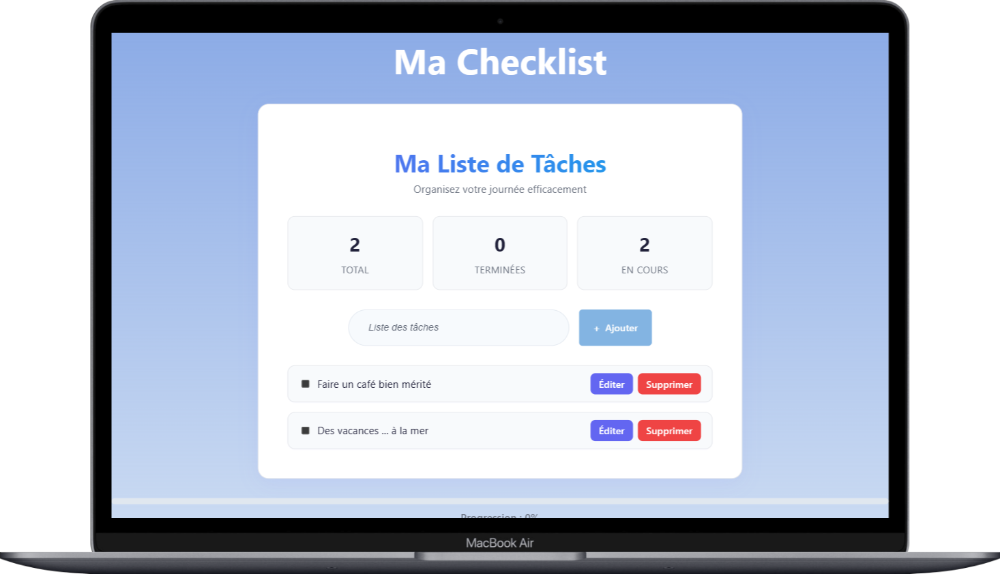
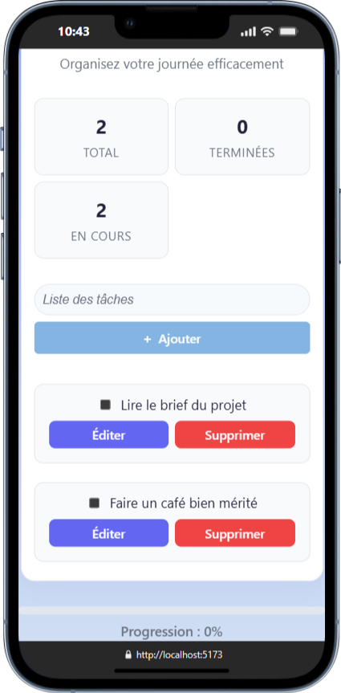
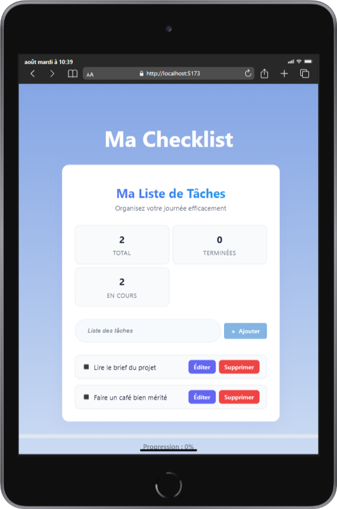

# 📝 Checklist App – Prototype React avec Vite


## Présentation

Checklist App est une application de gestion de tâches moderne, développée avec React et Vite. Elle permet d’ajouter, afficher, marquer comme terminée, éditer et supprimer des tâches, le tout dans une interface responsive et élégante.

---

## 1. Installation et configuration

### a. Prérequis

- **Node.js** (version recommandée LTS)
- **npm** (inclus avec Node.js)

### b. Installation de Node.js

1. Télécharger Node.js sur [nodejs.org](https://nodejs.org/)
2. Installer la version LTS
3. Vérifier l’installation :
   ```bash
   node -v
   npm -v
   ```

### c. Création et lancement du projet

1. Cloner le dépôt :
   ```bash
   git clone https://github.com/fannysaez/appChecklist-react.git
   cd checklist-app
   ```
2. Installer les dépendances :
   ```bash
   npm install
   ```
3. Lancer le serveur de développement :
   ```bash
   npm run dev
   ```
4. Ouvrir [http://localhost:5173](http://localhost:5173)

---

## 2. Structure du projet

```bash
checklist-app/
├── public/
├── src/
│   ├── assets/
│   │   └── components/
│   │       ├── AddTask/
│   │       │   ├── AddTask.jsx
│   │       │   └── AddTask.css
│   │       ├── DeleteTask/
│   │       │   ├── DeleteTask.jsx
│   │       │   └── DeleteTask.css
│   │       ├── EditTask/
│   │       │   ├── EditTask.jsx
│   │       │   └── EditTask.css
│   │       ├── TaskItem/
│   │       │   └── TaskItem.jsx
│   │       └── TaskList/
│   │           ├── TaskList.jsx
│   │           └── TaskList.css
│   ├── styles/
│   │   ├── globals.css
│   │   └── variables.css
│   ├── img/
│   │   ├── Desktop.png
│   │   ├── Mobile.png
│   │   └── Tablette.png
│   ├── App.jsx
│   ├── App.css
│   └── main.jsx
├── package.json
├── vite.config.js
└── README.md
```

- **Palette de couleurs** : `src/styles/variables.css`
- **Styles globaux** : `src/styles/globals.css`

---

## 2.b. Captures d'écran

Des captures d'écran de l'application sont disponibles dans `checklist-app/src/assets/img/` :

<div align="center">

<table>
   <tr>
      <td align="center"></td>
      <td align="center"></td>
      <td align="center"></td>
   </tr>
   <tr>
      <td align="center">Desktop</td>
      <td align="center">Mobile</td>
      <td align="center">Tablette</td>
   </tr>
</table>

</div>

---

## 3. Fonctionnalités principales

- **Ajout d’une tâche** : champ texte + bouton “Ajouter”
- **Affichage de la liste** : toutes les tâches visibles
- **Marquage comme terminée** : case à cocher/toggle
- **Édition inline** : double-clic ou bouton pour éditer
- **Suppression** : bouton + modal de confirmation
- **Statistiques** : total, terminées, en cours, progression
- **Responsive** : design adapté mobile/tablette

---

## 4. Logique de base React

- **Gestion de l’état** : `useState` pour la liste des tâches
- **Composants** : chaque fonctionnalité a son composant dédié
- **Props** : communication entre composants parents/enfants
- **Hooks** : `useEffect`, `useRef` pour focus, accessibilité, etc.
- **CSS Variables** : palette moderne, thèmes faciles à modifier

---

## 5. Difficultés rencontrées & solutions

- **Édition inline** : séparation claire entre affichage (`TaskItem`) et édition (`EditTask`)
- **Accessibilité modal** : focus automatique, gestion clavier (Entrée/Échap)
- **Gestion des IDs** : incrémentation sécurisée pour éviter les doublons
- **Responsive** : media queries et flexbox pour une UX optimale
- **Animations** : transitions CSS pour feedback visuel

---

