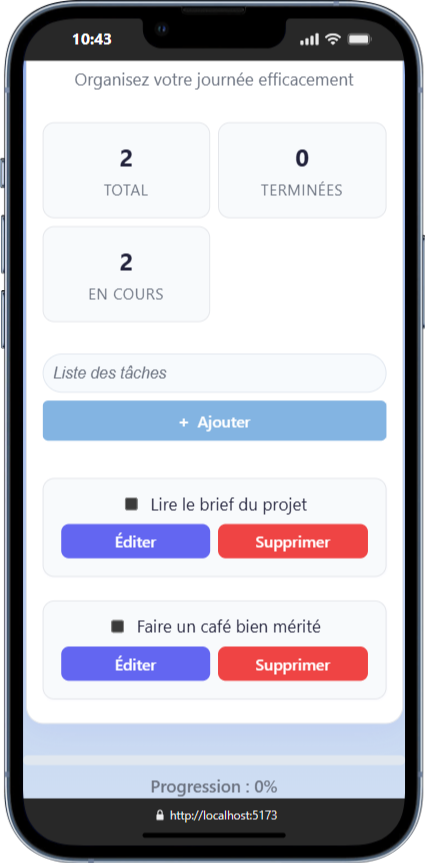

# 📝 Checklist App – Prototype React avec Vite


## Présentation

Checklist App est une application de gestion de tâches moderne, développée avec React et Vite. Elle permet d’ajouter, afficher, marquer comme terminée, éditer et supprimer des tâches, le tout dans une interface responsive et élégante.

---

## 1. Installation et configuration

### a. Prérequis

- **Node.js** (version recommandée LTS)
- **npm** (inclus avec Node.js)

### b. Installation de Node.js

1. Télécharger Node.js sur [nodejs.org](https://nodejs.org/)
2. Installer la version LTS
3. Vérifier l’installation :
   ```bash
   node -v
   npm -v
   ```

### c. Création et lancement du projet

1. Cloner le dépôt :
   ```bash
   git clone https://github.com/fannysaez/appChecklist-react.git
   cd checklist-app
   ```
2. Installer les dépendances :
   ```bash
   npm install
   ```
3. Lancer le serveur de développement :
   ```bash
   npm run dev
   ```
4. Ouvrir [http://localhost:5173](http://localhost:5173)

---

## 2. Structure du projet

```bash
checklist-app/
├── public/
├── src/
│   ├── assets/
│   │   └── components/
│   │       ├── AddTask/
│   │       │   ├── AddTask.jsx
│   │       │   └── AddTask.css
│   │       ├── DeleteTask/
│   │       │   ├── DeleteTask.jsx
│   │       │   └── DeleteTask.css
│   │       ├── EditTask/
│   │       │   ├── EditTask.jsx
│   │       │   └── EditTask.css
│   │       ├── TaskItem/
│   │       │   └── TaskItem.jsx
│   │       └── TaskList/
│   │           ├── TaskList.jsx
│   │           └── TaskList.css
│   ├── styles/
│   │   ├── globals.css
│   │   └── variables.css
│   ├── img/
│   │   ├── Desktop.png
│   │   ├── Mobile.png
│   │   └── Tablette.png
│   ├── App.jsx
│   ├── App.css
│   └── main.jsx
├── package.json
├── vite.config.js
└── README.md
```

- **Palette de couleurs** : `src/styles/variables.css`
- **Styles globaux** : `src/styles/globals.css`

---

## 2.b. Captures d'écran

Des captures d'écran de l'application sont disponibles dans `src/assets/img/` :

- 
- 
- 

---

## 3. Fonctionnalités principales

- **Ajout d’une tâche** : champ texte + bouton “Ajouter”
- **Affichage de la liste** : toutes les tâches visibles
- **Marquage comme terminée** : case à cocher/toggle
- **Édition inline** : double-clic ou bouton pour éditer
- **Suppression** : bouton + modal de confirmation
- **Statistiques** : total, terminées, en cours, progression
- **Responsive** : design adapté mobile/tablette

---

## 4. Logique de base React

- **Gestion de l’état** : `useState` pour la liste des tâches
- **Composants** : chaque fonctionnalité a son composant dédié
- **Props** : communication entre composants parents/enfants
- **Hooks** : `useEffect`, `useRef` pour focus, accessibilité, etc.
- **CSS Variables** : palette moderne, thèmes faciles à modifier

---

## 5. Difficultés rencontrées & solutions

- **Édition inline** : séparation claire entre affichage (`TaskItem`) et édition (`EditTask`)
- **Accessibilité modal** : focus automatique, gestion clavier (Entrée/Échap)
- **Gestion des IDs** : incrémentation sécurisée pour éviter les doublons
- **Responsive** : media queries et flexbox pour une UX optimale
- **Animations** : transitions CSS pour feedback visuel

---

## 6. Modalités d’évaluation

- Checklist fonctionnelle (ajout, affichage, marquage terminé sans rechargement)
- Code lisible, composants clairs, état bien géré
- Note explicative structurée (voir ci-dessus)
- Dépôt GitHub complet (code + note + instructions)

---

## 7. Palette de couleurs moderne

- **Primary** : #6366F1
- **Accent** : #EC4899
- **Secondary** : #F59E0B
- **Success** : #10B981
- **Warning** : #F59E0B
- **Error** : #EF4444
- ... (voir `variables.css`)

---

## 8. Pour aller plus loin

- Ajouter la persistance (localStorage, backend…)
- Ajouter la gestion multi-listes
- Améliorer l’accessibilité (ARIA, navigation clavier…)

---

## Auteur

- [Fanny SAEZ]
- [Lien GitHub]

# React + Vite

Ce modèle fournit une configuration minimale pour faire fonctionner React avec Vite, incluant le rechargement à chaud (HMR) et quelques règles ESLint.

Actuellement, deux plugins officiels sont disponibles :

- [@vitejs/plugin-react](https://github.com/vitejs/vite-plugin-react/blob/main/packages/plugin-react) uses [Babel](https://babeljs.io/) for Fast Refresh
- [@vitejs/plugin-react-swc](https://github.com/vitejs/vite-plugin-react/blob/main/packages/plugin-react-swc) uses [SWC](https://swc.rs/) for Fast Refresh

---

## Note explicative (Résumé)

### Étapes d’installation et configuration de Node.js

1. Télécharger Node.js sur [nodejs.org](https://nodejs.org/)
2. Installer la version LTS
3. Vérifier l’installation avec `node -v` et `npm -v`

### Étapes de création et test du projet React

1. Cloner le dépôt GitHub
2. Installer les dépendances avec `npm install`
3. Lancer le serveur de développement avec `npm run dev`
4. Accéder à l’application sur [http://localhost:5173](http://localhost:5173)

### Difficultés rencontrées et solutions adoptées

- **Édition inline** : séparation claire entre affichage (`TaskItem`) et édition (`EditTask`)
- **Accessibilité modal** : focus automatique, gestion clavier (Entrée/Échap)
- **Gestion des IDs** : incrémentation sécurisée pour éviter les doublons
- **Responsive** : media queries et flexbox pour une UX optimale
- **Animations** : transitions CSS pour feedback visuel

### Modalités d’évaluation

- Checklist fonctionnelle (ajout, affichage, marquage terminé sans rechargement)
- Code lisible, composants clairs, état bien géré
- Note explicative structurée (voir ci-dessus)
- Dépôt GitHub complet (code + note + instructions)

### Livrables

- Lien vers le dépôt GitHub (code + note)

### Critères de performance

- Environnement Node.js + React opérationnel
- Checklist fonctionnelle : ajout, affichage, marquage terminé (sans rechargement)
- Qualité du code : composants clairs, état bien géré, lisible et indenté
- Note claire et structurée, expliquant la démarche et les problèmes résolus
- Dépôt GitHub complet (code + note) et instructions pour lancer le projet

---

## Expanding the ESLint configuration

If you are developing a production application, we recommend using TypeScript with type-aware lint rules enabled. Check out the [TS template](https://github.com/vitejs/vite/tree/main/packages/create-vite/template-react-ts) for information on how to integrate TypeScript and [`typescript-eslint`](https://typescript-eslint.io) in your project.
